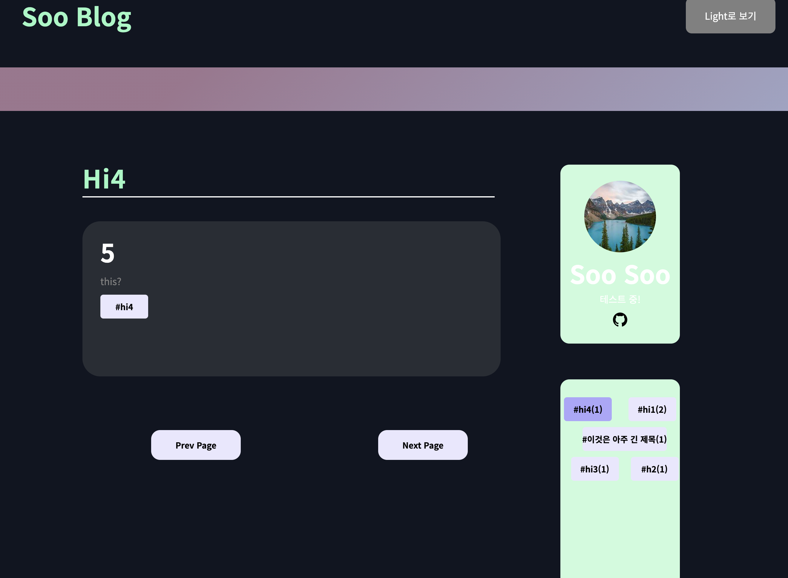

\*\*\*\*<!-- AUTO-GENERATED-CONTENT:START (STARTER) -->

  

<h1 align="center">
  Gatsby's hello-world starter
</h1>

# Gatsby-blog-project

---

## 구현중인 사항

---

(5.17)

- og:image tag가 seo시에 포함될 수 있도록 추가해주었습니다. 각 포스트의 대표사진이 포스트의 og:image tag의 content로 설정됩니다.
- 이와 함께 포스트의 대표사진이 자동으로 포스트 상단에 추가되도록 설정했습니다.
- 상단 nav bar를 sticky하게 만들어 스크롤 시에는 상단에 고정되게 만들었습니다.

---

- SEO
   
  react-helmet을 활용하여 SEO에 필요한 meta tag를 넣어주었습니다. og태그 추가하여 미리보기에 사용할 수 있게 했습니다.

* Multi-categorize
   
  각 블로그 포스트가 해쉬태그를 여러개 사용할 수 있도록 구현했습니다. 포스트 아이템이나 사이드바에 있는 해쉬태그를 선택하면 해당 태그에 속한 포스트 아이템들만 필터링하여 볼 수 있습니다.

* Dark mode
   
  CSS-Variable을 활용하여 Dark mode를 사용할 수 있게 구현했습니다. 설정된 테마를 localStorage에 저장하여 블로그 재방문 시에도 지정해 둔 테마를 사용할 수 있습니다.

* Code highlight with Dark mode
   
  Prism libary를 활용하여 마크다운 내에서 사용하는 코드블록에서 Code highlight를 해주었습니다. vsDark와 NightOwlLight 테마를 적용해서 각 테마에서 다른 highlight를 볼 수 있습니다.

* Pagination
   
  페이지마다 볼 포스트 아이템의 갯수를 지정하고 이에 따라 Paginate 할 수 있게 구현했습니다. 첫 페이지와 마지막 페이지에서는 각각 Prev page와 Next Page를 선택할 수 없습니다.

* Create Page Progamatically
   
  gatsby-node.js에서 actions의 createPage 메서드를 활용해 작성된 마크다운 파일들이 자동으로 페이지로 생성되도록 해주었습니다. 각 해쉬태그들을 graphql 내에서 Regex를 활용하여 검색하고 이에 따라 카테고리별로도 페이지가 생성됩니다.

  ---

  ## 추가(작업)중인 사항

* Intersection Observer를 활용해 NavBar가 일정 Height 이상 스크롤 시에 고정될 수 있도록
   
  최근 네이버 검색창 UI가 바뀐 것을 보고 비슷하게 구현해보려고 함.

* About 페이지 UI 추가

* utterance 활용해서 댓글 기능 추가
* Post Item/SEO 할 때 썸네일 이미지 들어갈 수 있게 추가
